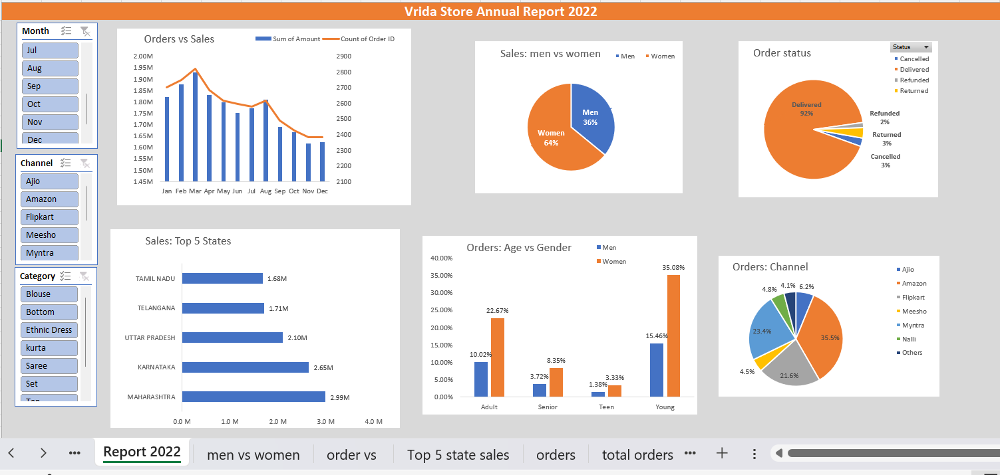

# Vrinda Store Data Analysis (Annual Report 2022)

## Project Objective
The goal of this project is to analyze the sales data of Vrinda Store for the year 2022 to uncover key trends, understand customer behavior, and provide actionable insights that can help drive business growth in 2023.

## Project Description
This project demonstrates a complete data analytics workflow in Excel. I transformed raw, unorganized sales data into a professional, interactive dashboard that allows stakeholders to filter data by month, sales channel, and product category.

## Key Insights
* **Target Audience:** Women are the primary customers, accounting for ~64% of total sales.
* **Top States:** Maharashtra, Karnataka, and Uttar Pradesh are the top 3 states contributing to revenue.
* **Customer Segment:** The "Adult" age group (30-49 years) is the highest contributing demographic.
* **Peak Performance:** Sales and orders show significant trends during specific months, allowing for better inventory planning.

## Data Analytics Lifecycle
### 1. Data Cleaning
* Standardized naming conventions (e.g., merging "M" and "Male").
* Handled missing values and ensured consistent data types across all columns.
* Removed duplicates to maintain data integrity.

### 2. Data Processing
* Created new columns for **Age Groups** (Teenager, Adult, Senior).
* Extracted **Months** from date columns for seasonal analysis.

### 3. Data Analysis (Pivot Tables)
* Compared **Sales vs. Orders** over a 12-month period.
* Analyzed shopping behavior based on **Gender** and **Age**.
* Identified the distribution of **Order Status** (Delivered, Refunded, Cancelled).
* Measured performance across different **Sales Channels** (Amazon, Flipkart, etc.).

### 4. Interactive Dashboard
* Integrated **Slicers** to allow dynamic filtering by Month, Channel, and Category.
* Used **Pivot Charts** to visualize complex data points for quick decision-making.

## Tools Used
* **Microsoft Excel:** Data cleaning, Pivot Tables, Pivot Charts, and Dashboard Design.

---
**Note:** To view the interactive elements, please download the `.xlsx` file and enable content in Microsoft Excel.

